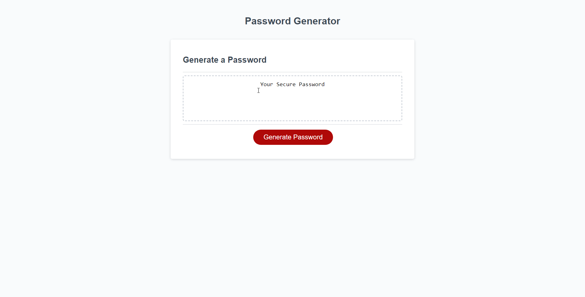

# password-generator

## Description

This project is built with hml, css, and javascript but is made with the goal of showcasing javascript skills learned. This website will allow a user to generate a password from 8-128 characters with the choice of all four types of password eligible characters (lowercase letters, uppercase letters, special characters, and numbers). Below is a gif demonstrating that it verifies user input, requires at least one of four options to be chosen, and outputs password properly based on input.

## Technologies Used

- [Visual Studio Code](https://code.visualstudio.com/)
- [Github](https://github.com/)

## Deployed Site

- [Password Generator](https://carmart7.github.io/password-generator/)